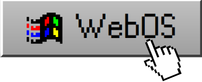

# WebOS

Welcome to WebOS!

    

## Introduction

WebOS is a web-based operating system simulation designed to bring back the charm of classic Windows versions right to your browser. Inspired by the parody website Windows 93 and developed in collaboration with ButterDebuggers' "WebOS" project, this simulation aims to provide a fun and interactive experience reminiscent of the early days of personal computing.

## Features

- **Windows 9x Simulation:** Experience the look and feel of Windows 9x operating systems directly in your browser.
- **Cross-Platform Compatibility:** Access WebOS from any modern web browser on various devices, including desktops, laptops, and tablets.
- **Responsive Design:** Enjoy seamless navigation and interaction, optimized for different screen sizes.
- **Future Expansion:** Stay tuned for upcoming features, including support for earlier and later versions of Windows, as well as MacOS-inspired styles.

## Feedback and Support

If you have any feedback, suggestions, or encounter any issues while using WebOS, please don't hesitate to reach out to us by [opening an issue](https://github.com/dvsloth/webos/issues). We value your input and are committed to improving the simulation based on community feedback.

## License

WebOS is licensed under the [MIT License](LICENSE), allowing you to use, modify, and distribute the software freely. See the LICENSE file for more details.

## Acknowledgments

Special thanks to ButterDebugger for their collaboration on the "WebOS" project and to the contributors who have helped shape this simulation.
